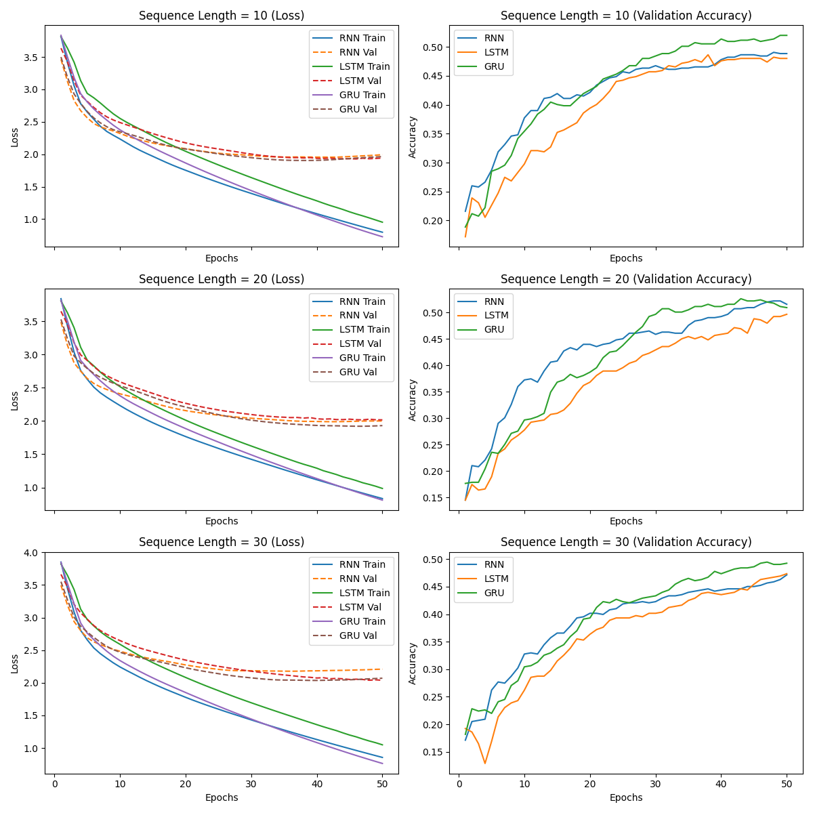
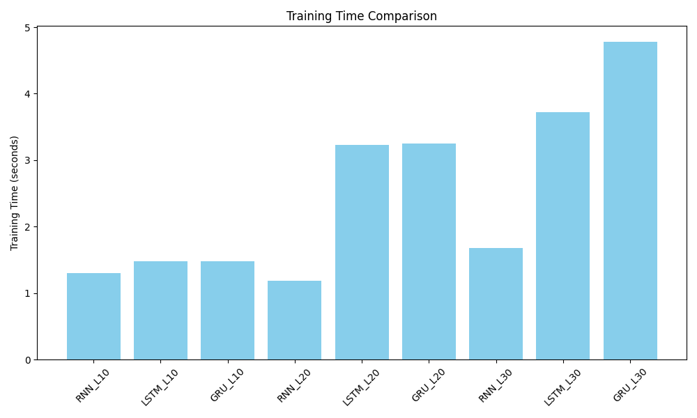
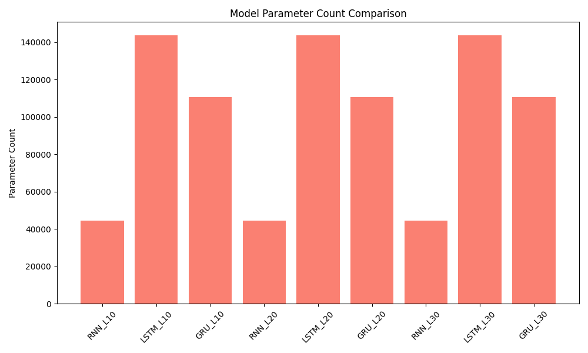

# ECGR-5106 Homework 3

## Student Information
**Name:** Yang Xu  
**Student ID:** 801443244  
**Homework Number:** 3  

## GitHub Repository
[https://github.com/yourusername/ecgr5106-hw3](https://github.com/yourusername/ecgr5106-hw3)

---

## Problem 1: Next-Character Prediction

### Introduction
In this problem, we focus on next-character prediction using three different recurrent models:
- **Vanilla RNN**  
- **LSTM**  
- **GRU**  

We train each model with three different sequence lengths: **10**, **20**, and **30**. The text is taken from the provided sequence in the assignment. We compare:
1. Training loss and validation accuracy  
2. Execution time for training  
3. Computational and model size complexities (parameter count)

### Implementation Details
- **Data Loading**: We read the text from `dataset.txt` and split it into an 80% training set and a 20% validation set.
- **Models**:
  - Each model has an embedding layer (`nn.Embedding`) of size 128, followed by either `nn.RNN`, `nn.LSTM`, or `nn.GRU`, and finally a fully connected layer for character classification.
- **Hyperparameters**:
  - **Hidden Size**: 128  
  - **Learning Rate**: 0.005  
  - **Optimizer**: Adam  
  - **Loss**: CrossEntropyLoss  
  - **Epochs**: 50  

### Training and Validation Results

Below are final metrics after 50 epochs for each sequence length and each model.

#### **Sequence Length = 10**

| Model | Parameter Count | Final Validation Accuracy | Training Time (s) |
|:-----:|:--------------:|:-------------------------:|:-----------------:|
| **RNN**  | 44,589   | 0.4885 | 1.30 |
| **LSTM** | 143,661 | 0.4801 | 1.48 |
| **GRU**  | 110,637 | 0.5199 | 1.48 |

<details>
<summary>Complete Training Logs (Click to Expand)</summary>

```bash
Training RNN with sequence length = 10, Parameter count: 44589 
Epoch 10/50, Loss: 2.2351, Val Loss: 2.3210, Val Acc: 0.3774 
Epoch 20/50, Loss: 1.7527, Val Loss: 2.0845, Val Acc: 0.4214 
Epoch 30/50, Loss: 1.3960, Val Loss: 1.9811, Val Acc: 0.4675 
Epoch 40/50, Loss: 1.0824, Val Loss: 1.9556, Val Acc: 0.4780 
Epoch 50/50, Loss: 0.7975, Val Loss: 1.9940, Val Acc: 0.4885 
Training completed in 1.30 seconds

Training LSTM with sequence length = 10, Parameter count: 143661 
Epoch 10/50, Loss: 2.5525, Val Loss: 2.4889, Val Acc: 0.2977 
Epoch 20/50, Loss: 2.0455, Val Loss: 2.1755, Val Acc: 0.3941 
Epoch 30/50, Loss: 1.6404, Val Loss: 2.0030, Val Acc: 0.4570 
Epoch 40/50, Loss: 1.2815, Val Loss: 1.9370, Val Acc: 0.4759 
Epoch 50/50, Loss: 0.9520, Val Loss: 1.9413, Val Acc: 0.4801 
Training completed in 1.48 seconds

Training GRU with sequence length = 10, Parameter count: 110637 
Epoch 10/50, Loss: 2.3763, Val Loss: 2.3461, Val Acc: 0.3543 
Epoch 20/50, Loss: 1.8647, Val Loss: 2.0807, Val Acc: 0.4256 
Epoch 30/50, Loss: 1.4398, Val Loss: 1.9471, Val Acc: 0.4843 
Epoch 40/50, Loss: 1.0628, Val Loss: 1.9059, Val Acc: 0.5136 
Epoch 50/50, Loss: 0.7276, Val Loss: 1.9642, Val Acc: 0.5199 
Training completed in 1.48 seconds
```

</details>

---

#### **Sequence Length = 20**

| Model | Parameter Count | Final Validation Accuracy | Training Time (s) |
|:-----:|:--------------:|:-------------------------:|:-----------------:|
| **RNN**  | 44,589   | 0.5158 | 1.18 |
| **LSTM** | 143,661 | 0.4968 | 3.23 |
| **GRU**  | 110,637 | 0.5095 | 3.25 |

<details>
<summary>Complete Training Logs (Click to Expand)</summary>

```bash
Training RNN with sequence length = 20, Parameter count: 44589 
Epoch 10/50, Loss: 2.2314, Val Loss: 2.4080, Val Acc: 0.3726 
Epoch 20/50, Loss: 1.7657, Val Loss: 2.1556, Val Acc: 0.4400 
Epoch 30/50, Loss: 1.4241, Val Loss: 2.0409, Val Acc: 0.4589 
Epoch 40/50, Loss: 1.1166, Val Loss: 1.9922, Val Acc: 0.4926 
Epoch 50/50, Loss: 0.8333, Val Loss: 1.9995, Val Acc: 0.5158 
Training completed in 1.18 seconds

Training LSTM with sequence length = 20, Parameter count: 143661 
Epoch 10/50, Loss: 2.5153, Val Loss: 2.5869, Val Acc: 0.2779 
Epoch 20/50, Loss: 2.0121, Val Loss: 2.2652, Val Acc: 0.3684 
Epoch 30/50, Loss: 1.6237, Val Loss: 2.0967, Val Acc: 0.4295 
Epoch 40/50, Loss: 1.2898, Val Loss: 2.0324, Val Acc: 0.4589 
Epoch 50/50, Loss: 0.9856, Val Loss: 2.0165, Val Acc: 0.4968 
Training completed in 3.23 seconds

Training GRU with sequence length = 20, Parameter count: 110637 
Epoch 10/50, Loss: 2.3783, Val Loss: 2.5299, Val Acc: 0.2968 
Epoch 20/50, Loss: 1.8855, Val Loss: 2.2087, Val Acc: 0.3874 
Epoch 30/50, Loss: 1.4910, Val Loss: 2.0123, Val Acc: 0.4968 
Epoch 40/50, Loss: 1.1338, Val Loss: 1.9327, Val Acc: 0.5116 
Epoch 50/50, Loss: 0.8104, Val Loss: 1.9302, Val Acc: 0.5095 
Training completed in 3.25 seconds
```

</details>

---

#### **Sequence Length = 30**

| Model | Parameter Count | Final Validation Accuracy | Training Time (s) |
|:-----:|:--------------:|:-------------------------:|:-----------------:|
| **RNN**  | 44,589   | 0.4715 | 1.68 |
| **LSTM** | 143,661 | 0.4736 | 3.72 |
| **GRU**  | 110,637 | 0.4926 | 4.78 |

<details>
<summary>Complete Training Logs (Click to Expand)</summary>

```bash
Training RNN with sequence length = 30, Parameter count: 44589 
Epoch 10/50, Loss: 2.2425, Val Loss: 2.4831, Val Acc: 0.3277 
Epoch 20/50, Loss: 1.7770, Val Loss: 2.2735, Val Acc: 0.4017 
Epoch 30/50, Loss: 1.4311, Val Loss: 2.1845, Val Acc: 0.4228 
Epoch 40/50, Loss: 1.1297, Val Loss: 2.1834, Val Acc: 0.4440 
Epoch 50/50, Loss: 0.8554, Val Loss: 2.2085, Val Acc: 0.4715 
Training completed in 1.68 seconds

Training LSTM with sequence length = 30, Parameter count: 143661 
Epoch 10/50, Loss: 2.5897, Val Loss: 2.6465, Val Acc: 0.2622 
Epoch 20/50, Loss: 2.0817, Val Loss: 2.3477, Val Acc: 0.3636 
Epoch 30/50, Loss: 1.6937, Val Loss: 2.1771, Val Acc: 0.4017 
Epoch 40/50, Loss: 1.3579, Val Loss: 2.0731, Val Acc: 0.4355 
Epoch 50/50, Loss: 1.0487, Val Loss: 2.0374, Val Acc: 0.4736 
Training completed in 3.72 seconds

Training GRU with sequence length = 30, Parameter count: 110637 
Epoch 10/50, Loss: 2.3400, Val Loss: 2.4679, Val Acc: 0.3044 
Epoch 20/50, Loss: 1.8506, Val Loss: 2.2301, Val Acc: 0.3932 
Epoch 30/50, Loss: 1.4442, Val Loss: 2.0753, Val Acc: 0.4334 
Epoch 40/50, Loss: 1.0829, Val Loss: 2.0358, Val Acc: 0.4736 
Epoch 50/50, Loss: 0.7630, Val Loss: 2.0699, Val Acc: 0.4926 
Training completed in 4.78 seconds
```

</details>

---

### Observations and Analysis

1. **Parameter Count**  
   - RNN consistently has the fewest parameters (~44k).  
   - GRU has an intermediate parameter count (~110k).  
   - LSTM has the highest parameter count (~144k).  

2. **Training Time**  
   - RNN trains the fastest due to its simpler structure and fewer parameters.  
   - LSTM and GRU take longer to train, especially with longer sequences (30).  
   - GRU generally takes slightly longer than LSTM at sequence length 30, as seen in the logs.

3. **Validation Accuracy**  
   - For sequence length = 10, **GRU** has the best accuracy (0.5199).  
   - For sequence length = 20, **RNN** surprisingly achieves the best final validation accuracy (0.5158).  
   - For sequence length = 30, **GRU** performs best (0.4926).  
   - LSTM performs well but does not consistently achieve the highest accuracy under these hyperparameters.

4. **Longer Sequences**  
   - Longer sequences (30) do not guarantee higher accuracy in these runs. Model capacity, data size, and hyperparameters all play a role.

### Training and Validation Loss & Accuracy Plots
- **Combined Loss & Accuracy Curves**  
  

- **Training Time Comparison**  
  

- **Model Parameter Count Comparison**  
  

---

## Problem 2: Tiny Shakespeare Dataset (Placeholder)
**(To be completed as per assignment instructions.)**

1. Build LSTM and GRU models for the tiny Shakespeare dataset.  
2. Compare training loss, validation accuracy, execution time, and model complexity for sequence lengths 20 and 30.  
3. Adjust hyperparameters and analyze their influence on performance.  
4. Increase sequence length to 50 and report results.

*(Analysis and results will be added here.)*

---

**End of Report**  
Please refer to the GitHub repository for the complete source code, including data loading, model definitions, and training scripts. 
