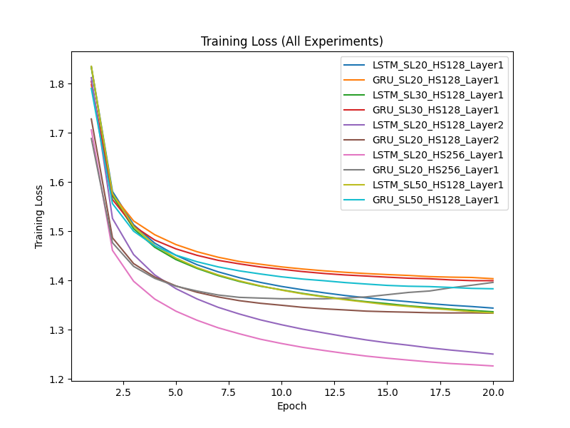

# ECGR-5106 Homework 3

## Student Information
**Name:** Yang Xu  
**Student ID:** 801443244  
**Homework Number:** 3  

## GitHub Repository
[https://github.com/xuy50/ecgr5106-hw3](https://github.com/xuy50/ecgr5106-hw3)

---

## Problem 1: Next-Character Prediction

### Introduction
In this problem, we focus on next-character prediction using three different recurrent models:
- **Vanilla RNN**  
- **LSTM**  
- **GRU**  

We train each model with three different sequence lengths: **10**, **20**, and **30**. The text is taken from the provided sequence in the assignment. We compare:
1. Training loss and validation accuracy  
2. Execution time for training  
3. Computational and model size complexities (parameter count)

### Implementation Details
- **Data Loading**: We read the text from `dataset.txt` and split it into an 80% training set and a 20% validation set.
- **Models**:
  - Each model has an embedding layer (`nn.Embedding`) of size 128, followed by either `nn.RNN`, `nn.LSTM`, or `nn.GRU`, and finally a fully connected layer for character classification.
- **Hyperparameters**:
  - **Hidden Size**: 128  
  - **Learning Rate**: 0.005  
  - **Optimizer**: Adam  
  - **Loss**: CrossEntropyLoss  
  - **Epochs**: 50  

### Training and Validation Results

Below are final metrics after 50 epochs for each sequence length and each model.

#### **Sequence Length = 10**

| Model | Parameter Count | Final Validation Accuracy | Training Time (s) |
|:-----:|:--------------:|:-------------------------:|:-----------------:|
| **RNN**  | 44,589   | 0.4885 | 1.30 |
| **LSTM** | 143,661 | 0.4801 | 1.48 |
| **GRU**  | 110,637 | 0.5199 | 1.48 |

<details>
<summary>Complete Training Logs (Click to Expand)</summary>

```text
Training RNN with sequence length = 10, Parameter count: 44589 
Epoch 10/50, Loss: 2.2351, Val Loss: 2.3210, Val Acc: 0.3774 
Epoch 20/50, Loss: 1.7527, Val Loss: 2.0845, Val Acc: 0.4214 
Epoch 30/50, Loss: 1.3960, Val Loss: 1.9811, Val Acc: 0.4675 
Epoch 40/50, Loss: 1.0824, Val Loss: 1.9556, Val Acc: 0.4780 
Epoch 50/50, Loss: 0.7975, Val Loss: 1.9940, Val Acc: 0.4885 
Training completed in 1.30 seconds

Training LSTM with sequence length = 10, Parameter count: 143661 
Epoch 10/50, Loss: 2.5525, Val Loss: 2.4889, Val Acc: 0.2977 
Epoch 20/50, Loss: 2.0455, Val Loss: 2.1755, Val Acc: 0.3941 
Epoch 30/50, Loss: 1.6404, Val Loss: 2.0030, Val Acc: 0.4570 
Epoch 40/50, Loss: 1.2815, Val Loss: 1.9370, Val Acc: 0.4759 
Epoch 50/50, Loss: 0.9520, Val Loss: 1.9413, Val Acc: 0.4801 
Training completed in 1.48 seconds

Training GRU with sequence length = 10, Parameter count: 110637 
Epoch 10/50, Loss: 2.3763, Val Loss: 2.3461, Val Acc: 0.3543 
Epoch 20/50, Loss: 1.8647, Val Loss: 2.0807, Val Acc: 0.4256 
Epoch 30/50, Loss: 1.4398, Val Loss: 1.9471, Val Acc: 0.4843 
Epoch 40/50, Loss: 1.0628, Val Loss: 1.9059, Val Acc: 0.5136 
Epoch 50/50, Loss: 0.7276, Val Loss: 1.9642, Val Acc: 0.5199 
Training completed in 1.48 seconds
```

</details>

---

#### **Sequence Length = 20**

| Model | Parameter Count | Final Validation Accuracy | Training Time (s) |
|:-----:|:--------------:|:-------------------------:|:-----------------:|
| **RNN**  | 44,589   | 0.5158 | 1.18 |
| **LSTM** | 143,661 | 0.4968 | 3.23 |
| **GRU**  | 110,637 | 0.5095 | 3.25 |

<details>
<summary>Complete Training Logs (Click to Expand)</summary>

```text
Training RNN with sequence length = 20, Parameter count: 44589 
Epoch 10/50, Loss: 2.2314, Val Loss: 2.4080, Val Acc: 0.3726 
Epoch 20/50, Loss: 1.7657, Val Loss: 2.1556, Val Acc: 0.4400 
Epoch 30/50, Loss: 1.4241, Val Loss: 2.0409, Val Acc: 0.4589 
Epoch 40/50, Loss: 1.1166, Val Loss: 1.9922, Val Acc: 0.4926 
Epoch 50/50, Loss: 0.8333, Val Loss: 1.9995, Val Acc: 0.5158 
Training completed in 1.18 seconds

Training LSTM with sequence length = 20, Parameter count: 143661 
Epoch 10/50, Loss: 2.5153, Val Loss: 2.5869, Val Acc: 0.2779 
Epoch 20/50, Loss: 2.0121, Val Loss: 2.2652, Val Acc: 0.3684 
Epoch 30/50, Loss: 1.6237, Val Loss: 2.0967, Val Acc: 0.4295 
Epoch 40/50, Loss: 1.2898, Val Loss: 2.0324, Val Acc: 0.4589 
Epoch 50/50, Loss: 0.9856, Val Loss: 2.0165, Val Acc: 0.4968 
Training completed in 3.23 seconds

Training GRU with sequence length = 20, Parameter count: 110637 
Epoch 10/50, Loss: 2.3783, Val Loss: 2.5299, Val Acc: 0.2968 
Epoch 20/50, Loss: 1.8855, Val Loss: 2.2087, Val Acc: 0.3874 
Epoch 30/50, Loss: 1.4910, Val Loss: 2.0123, Val Acc: 0.4968 
Epoch 40/50, Loss: 1.1338, Val Loss: 1.9327, Val Acc: 0.5116 
Epoch 50/50, Loss: 0.8104, Val Loss: 1.9302, Val Acc: 0.5095 
Training completed in 3.25 seconds
```

</details>

---

#### **Sequence Length = 30**

| Model | Parameter Count | Final Validation Accuracy | Training Time (s) |
|:-----:|:--------------:|:-------------------------:|:-----------------:|
| **RNN**  | 44,589   | 0.4715 | 1.68 |
| **LSTM** | 143,661 | 0.4736 | 3.72 |
| **GRU**  | 110,637 | 0.4926 | 4.78 |

<details>
<summary>Complete Training Logs (Click to Expand)</summary>

```text
Training RNN with sequence length = 30, Parameter count: 44589 
Epoch 10/50, Loss: 2.2425, Val Loss: 2.4831, Val Acc: 0.3277 
Epoch 20/50, Loss: 1.7770, Val Loss: 2.2735, Val Acc: 0.4017 
Epoch 30/50, Loss: 1.4311, Val Loss: 2.1845, Val Acc: 0.4228 
Epoch 40/50, Loss: 1.1297, Val Loss: 2.1834, Val Acc: 0.4440 
Epoch 50/50, Loss: 0.8554, Val Loss: 2.2085, Val Acc: 0.4715 
Training completed in 1.68 seconds

Training LSTM with sequence length = 30, Parameter count: 143661 
Epoch 10/50, Loss: 2.5897, Val Loss: 2.6465, Val Acc: 0.2622 
Epoch 20/50, Loss: 2.0817, Val Loss: 2.3477, Val Acc: 0.3636 
Epoch 30/50, Loss: 1.6937, Val Loss: 2.1771, Val Acc: 0.4017 
Epoch 40/50, Loss: 1.3579, Val Loss: 2.0731, Val Acc: 0.4355 
Epoch 50/50, Loss: 1.0487, Val Loss: 2.0374, Val Acc: 0.4736 
Training completed in 3.72 seconds

Training GRU with sequence length = 30, Parameter count: 110637 
Epoch 10/50, Loss: 2.3400, Val Loss: 2.4679, Val Acc: 0.3044 
Epoch 20/50, Loss: 1.8506, Val Loss: 2.2301, Val Acc: 0.3932 
Epoch 30/50, Loss: 1.4442, Val Loss: 2.0753, Val Acc: 0.4334 
Epoch 40/50, Loss: 1.0829, Val Loss: 2.0358, Val Acc: 0.4736 
Epoch 50/50, Loss: 0.7630, Val Loss: 2.0699, Val Acc: 0.4926 
Training completed in 4.78 seconds
```

</details>

---

### Observations and Analysis

1. **Parameter Count**  
   - RNN consistently has the fewest parameters (~44k).  
   - GRU has an intermediate parameter count (~110k).  
   - LSTM has the highest parameter count (~144k).  

2. **Training Time**  
   - RNN trains the fastest due to its simpler structure and fewer parameters.  
   - LSTM and GRU take longer to train, especially with longer sequences (30).  
   - GRU generally takes slightly longer than LSTM at sequence length 30, as seen in the logs.

3. **Validation Accuracy**  
   - For sequence length = 10, **GRU** has the best accuracy (0.5199).  
   - For sequence length = 20, **RNN** achieves the best final validation accuracy (0.5158).  
   - For sequence length = 30, **GRU** performs best (0.4926).  
   - LSTM performs well but does not consistently achieve the highest accuracy under these hyperparameters.

4. **Longer Sequences**  
   - Longer sequences (30) do not guarantee higher accuracy in these runs. Model capacity, data size, and hyperparameters all play a role.

### Training and Validation Loss & Accuracy Plots
- **Combined Loss & Accuracy Curves**  
  

- **Training Time Comparison**  
  

- **Model Parameter Count Comparison**  
  

---

## Problem 2: Tiny Shakespeare Dataset

### Introduction
In **Problem 2**, work with the tiny Shakespeare dataset. Build and compare **LSTM** and **GRU** models at a character level, evaluating their performance on different sequence lengths (20, 30, and 50) and with various hyperparameter configurations (e.g., number of layers, hidden size). The primary goals are:

1. **Compare training loss, validation accuracy, execution time, and model complexity** for sequence lengths of **20** and **30**.  
2. **Adjust hyperparameters** (fully connected network size, number of hidden layers, number of hidden states) and observe changes in performance, training/inference time, and computational perplexity.  
3. **Extend sequence length to 50** and report final accuracy and model complexity.  

### Implementation Details

1. **Data Loading**  
   - The dataset is downloaded from the [tiny Shakespeare](https://raw.githubusercontent.com/karpathy/char-rnn/master/data/tinyshakespeare/input.txt) URL.  
   - We encode each character as an integer and split the dataset into training (80%) and validation (20%) sets.  
   - We create sequences of length *L* (where *L* is 20, 30, or 50) and use the next character as the target label.

2. **Models**  
   - **ShakespeareLSTM**: Uses an `nn.Embedding` layer followed by `nn.LSTM` and a final linear layer.  
   - **ShakespeareGRU**: Same overall structure but replaces the LSTM cell with `nn.GRU`.  
   - Hyperparameters we varied include:  
     - **Hidden Size**: 128 or 256  
     - **Number of Layers**: 1 or 2  
     - **Sequence Length**: 20, 30, 50  

3. **Training Setup**  
   - **Loss Function**: `CrossEntropyLoss`  
   - **Optimizer**: Adam (learning rate = 0.001)  
   - **Batch Size**: 128  
   - **Epochs**: 20  
   - **Metrics**: Training Loss, Validation Loss, Validation Accuracy, Training Time, and Parameter Count  

### Results and Analysis

Below are the training curves for **training loss**, **validation loss**, and **validation accuracy** across all experiments. We tested multiple configurations of LSTM and GRU with different sequence lengths, hidden sizes, and numbers of layers.

- **Training Loss (All Experiments)**  
  

- **Validation Loss (All Experiments)**  
  

- **Validation Accuracy (All Experiments)**  
  

#### Final Summary of Experiments

The table below shows the final training loss, validation loss, validation accuracy, parameter count, and training time for each configuration. Note that **SeqLen** refers to the sequence length (20, 30, or 50), **HiddenSize** is the hidden state dimension, and **Layers** is the number of LSTM/GRU layers.

| Model | SeqLen | HiddenSize | Layers |    Params   | Final Train Loss | Final Val Loss | Final Val Acc |  Training Time (s) |
|:-----:|:------:|:----------:|:------:|:-----------:|:----------------:|:--------------:|:-------------:|:------------------:|
| LSTM  |   20   |    128     |   1    |   148801    |       1.3438     |     1.4039     |     0.5721    |       169.94       |
| GRU   |   20   |    128     |   1    |   115777    |       1.4035     |     1.4408     |     0.5614    |       162.34       |
| LSTM  |   30   |    128     |   1    |   148801    |       1.3363     |     1.3933     |     0.5760    |       199.60       |
| GRU   |   30   |    128     |   1    |   115777    |       1.3994     |     1.4357     |     0.5648    |       180.45       |
| LSTM  |   20   |    128     |   2    |   280897    |       1.2504     |     1.3594     |     0.5843    |       232.57       |
| GRU   |   20   |    128     |   2    |   214849    |       1.3334     |     1.3945     |     0.5729    |       183.21       |
| LSTM  |   20   |    256     |   1    |   420289    |       1.2263     |     1.3646     |     0.5835    |       215.36       |
| GRU   |   20   |    256     |   1    |   321473    |       1.3959     |     1.4412     |     0.5607    |       216.45       |
| LSTM  |   50   |    128     |   1    |   148801    |       1.3340     |     1.3864     |     0.5771    |       246.05       |
| GRU   |   50   |    128     |   1    |   115777    |       1.3830     |     1.4268     |     0.5671    |       208.60       |

#### Observations

1. **Sequence Length (20 vs 30 vs 50)**  
   - There is no strict monotonic relationship between sequence length and final accuracy. Sometimes 20 or 30 yields better results than 50.  
   - Longer sequences typically increase training time, as more time steps must be processed.

2. **LSTM vs. GRU**  
   - **LSTM** often achieves slightly higher validation accuracy but may take longer to train.  
   - **GRU** is more parameter-efficient compared to LSTM with the same hidden size and layers, which can result in shorter training times.

3. **Hyperparameter Adjustments**  
   - **Increasing Hidden Size**: Models with hidden size = 256 tend to have higher accuracy, but also show increased training time and parameter count.  
   - **Multiple Layers**: Stacking 2 layers (LSTM or GRU) often improves accuracy but also increases computational cost. For example, the 2-layer LSTM (SeqLen=20, HiddenSize=128) reached **0.5843** final validation accuracy at the cost of a higher parameter count (280k) and longer training time (232.57s).

4. **Training vs. Validation Loss**  
   - Both LSTM and GRU show steadily decreasing training and validation losses, but validation accuracy saturates or slowly increases, indicating the models are learning effectively.

5. **Inference and Practical Considerations**  
   - Larger hidden sizes and multiple layers can yield better performance, but the increased parameter count also raises memory usage and inference time.  
   - Depending on the application constraints, a simpler 1-layer GRU with hidden size 128 might offer a good balance of speed and accuracy.

### Conclusion
In **Problem 2**, we observed the trade-offs between LSTM and GRU under different sequence lengths and hyperparameter settings. Key takeaways include:

- **LSTM** can achieve slightly better accuracy in some configurations but typically requires more parameters and training time.  
- **GRU** is more parameter-efficient and trains somewhat faster, though sometimes with slightly lower accuracy.  
- **Increasing the sequence length** from 20 to 50 did not guarantee improved accuracy; model capacity, data size, and hyperparameters all influence final results.  
- **Increasing hidden size or stacking multiple layers** can boost accuracy but at the cost of increased model complexity and training time.

Overall, these experiments highlight how the choice of recurrent architecture (LSTM vs. GRU), sequence length, and hyperparameters can significantly affect both performance and computational overhead.
